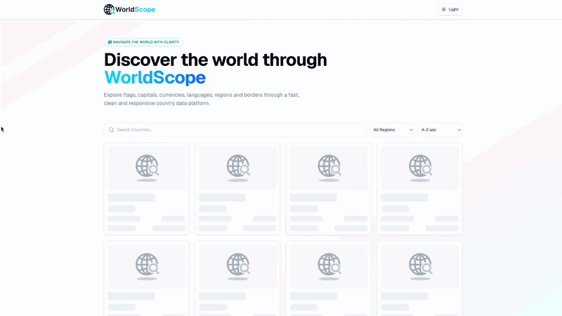
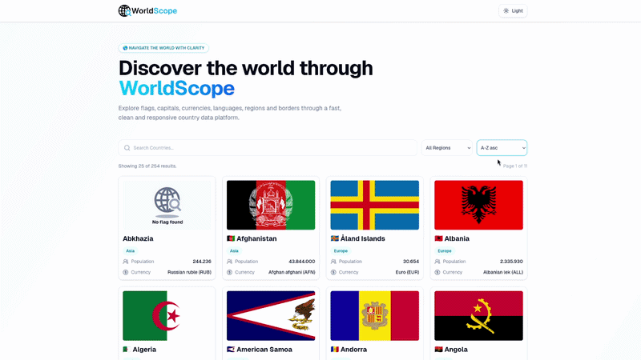
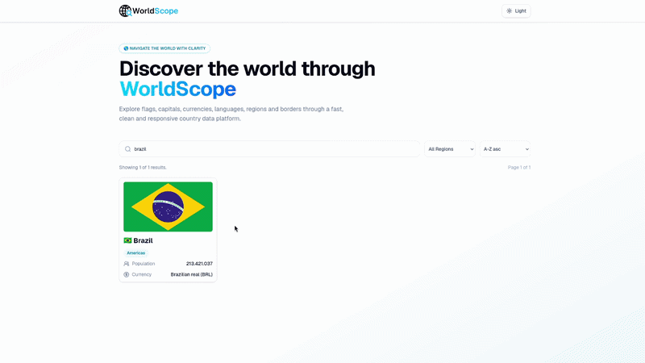

# WorldScope

<p align="center">
  
</p>

<p align="center">
  Explore countries, flags, regions, currencies, languages and borders through a clean and responsive country data platform.
</p>

<p align="center">
  
  
  
  
</p>

## 📘 Sobre

> Este projeto foi desenvolvido como parte do desafio técnico para a vaga de **Desenvolvedor Front-End** no Processo Seletivo 2026.2 da **Knex Consultoria Jr.**

**WorldScope** é uma aplicação web para consulta e exploração de informações geográficas de países. A aplicação permite pesquisar, filtrar, ordenar e visualizar detalhes de países de forma simples, rápida e responsiva.

O projeto consome a **RestCountries API v5**, exibindo dados como bandeira, nome, região, população, moeda, capital, idiomas, fusos horários, área territorial e países fronteiriços.

**Acesse o projeto:** [https://worldscope-navy.vercel.app](https://worldscope-navy.vercel.app)

<p align="center">
  
</p>

## ✅ Funcionalidades

A página inicial exibe os países em cards com bandeira, nome, região, população e moeda principal. A listagem possui busca em tempo real, filtro por região, ordenação por nome ou população e paginação.

<p align="center">
  
</p>

Ao selecionar um país, o usuário é direcionado para uma página dedicada com informações completas, incluindo nome oficial, capital, região, sub-região, população, área territorial, moedas, idiomas falados, fusos horários e países fronteiriços clicáveis.

<p align="center">
  
</p>

A interface também conta com tema claro, escuro e sistema, com persistência da preferência entre sessões.

<p align="center">
  
</p>

Outros estados tratados pela aplicação:

- carregamento com skeleton loading
- erro de API com mensagem amigável
- estado vazio quando nenhum país é encontrado
- fallback para dados ausentes retornados pela API
- layout responsivo para desktop e mobile

## ⚙️ Tecnologias

- **React**: construção da interface com componentes reutilizáveis.
- **TypeScript**: tipagem dos dados da API, props, hooks e funções auxiliares.
- **Vite**: ambiente de desenvolvimento rápido e simples.
- **Tailwind CSS**: estilização responsiva.
- **React Router DOM**: gerenciamento de rotas da aplicação.
- **TanStack Query**: gerenciamento de requisições, loading, erros e cache dos dados. Como os dados de países mudam com pouca frequência, o cache reduz chamadas desnecessárias à API. Apesar de adicionar uma dependência extra, há um ganho em organização e performance percebida.
- **Lucide React**: ícones leves e consistentes.
- **RestCountries API v5**: fonte dos dados geográficos.

## 🛠️ Como rodar localmente

Clone o repositório:

```bash
git clone https://github.com/not2nder/worldscope-knex-challenge.git
```

### 2. Acesse a pasta do projeto

```bash
cd worldscope-knex-challenge
```

### 3. Instale as dependências

```bash
npm install
```

### 4. Configure as variáveis de ambiente

Crie um arquivo `.env` na raíz do projeto com base no template `.env.example`.

```bash
VITE_BASE_URL=https://api.restcountries.com/countries/v5
VITE_API_KEY=sua_chave_da_api
```

### 5. Rode o projeto localmente

```bash
npm run dev
```

A aplicação estará disponível em: `http://localhost:5173`

## 🗂️ Estrutura do Projeto

A estrutura do projeto foi organizada de forma a separar responsabilidades e facilitar a manutenção do código.

```txt
src/
├── assets/         Logos e arquivos estáticos usados pela UI
├── components/     Componentes reutilizáveis de UI
├── hooks/          Hooks customizados da aplicação
├── layouts/        Estruturas visuais compartilhadas entre páginas
├── pages/          Páginas principais da aplicação
├── routes/         Configuração das rotas da aplicação
├── services/       Comunicação com APIs externas
├── styles/         Estilos globais
├── types/          Tipagens TypeScript compartilhadas
├── utils/          Funções auxiliares
├── App.tsx         Componente raiz da aplicação
└── main.tsx        Ponto de entrada do React
```

Essa organização mantém os componentes focados na interface, enquanto regras de busca, filtros, rotas, tipagens e chamadas externas ficam isoladas em suas próprias camadas. Dessa forma, o projeto se torna mais fácil de entender e expandir.

## 👤 Autor

Desenvolvido por Anderson.

GitHub: [@not2nder](https://github.com/not2nder)
